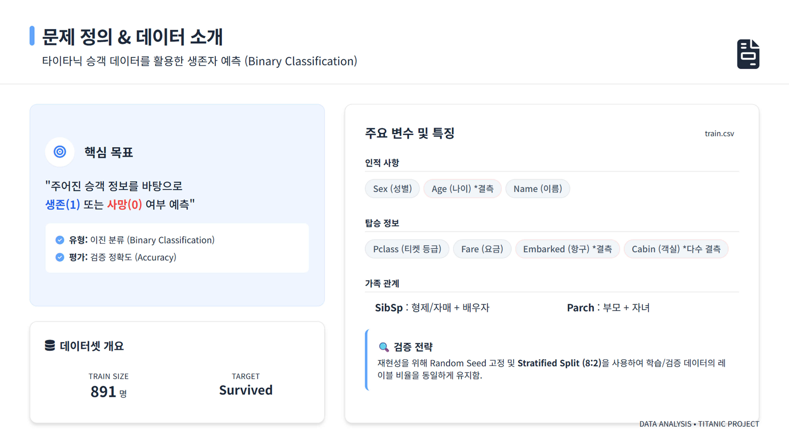
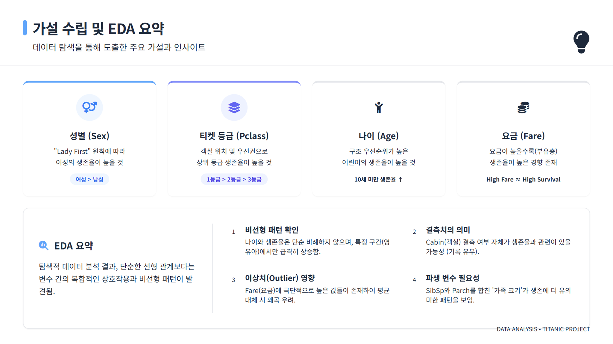
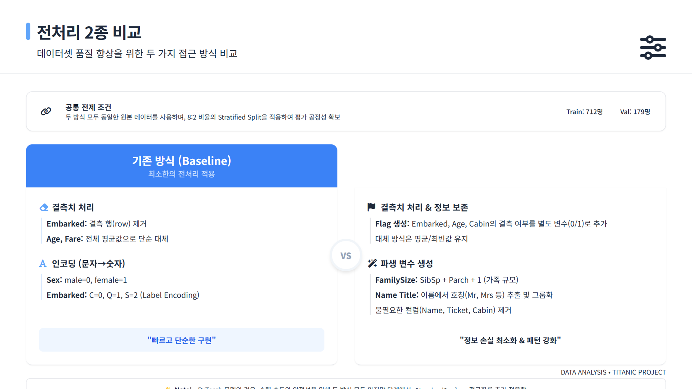
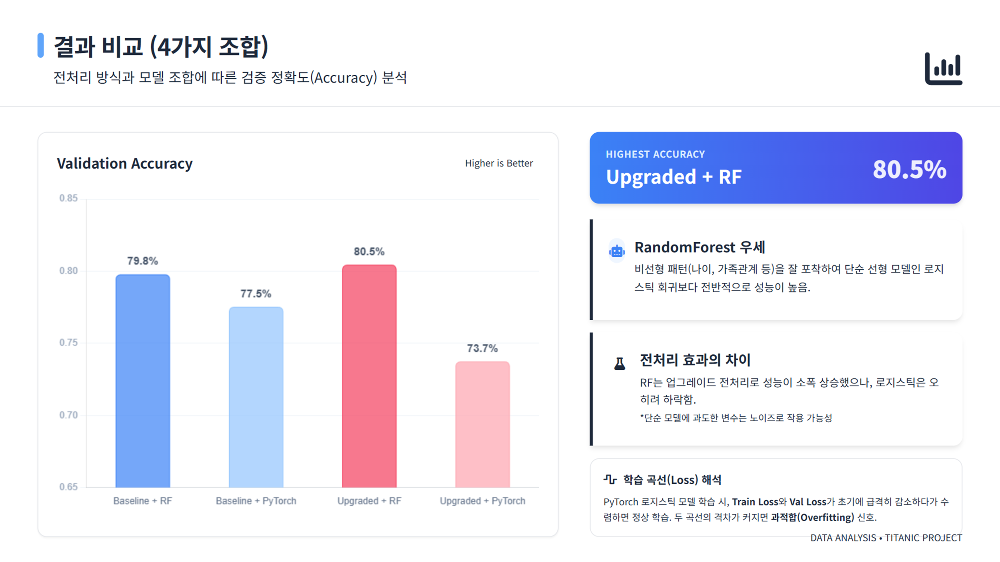
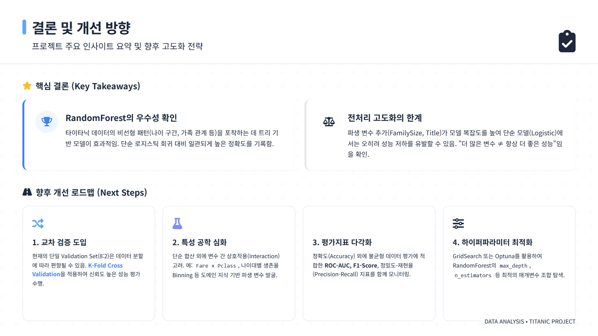

# Titanic Survival Prediction (전처리 × 모델 비교)

타이타닉 생존 예측 데이터를 사용해 **전처리 2종(기존/업그레이드)**과 **모델 2종(PyTorch/RandomForest)**을 조합하여 총 4가지 성능을 비교한 프로젝트입니다.

## 프로젝트 요약
- **전처리**: Baseline vs Upgraded
- **모델**: PyTorch 로지스틱 회귀 vs scikit-learn RandomForest
- **결과**: 4가지 조합의 검증 정확도와 학습곡선(Train/Val loss) 비교

## 슬라이드 스크린샷

## 파일 구조
- `model_compare_pytorch_sklearn.ipynb` : 전처리 2종 × 모델 2종 비교 노트북
- `train.csv`, `test.csv` : 데이터
- `submission.csv` : 예측 결과 예시 파일

## 실행 방법
### 로컬 Jupyter
1. 이 폴더에서 Jupyter 실행
2. `model_compare_pytorch_sklearn.ipynb`를 열고 위에서 아래로 실행

### Google Colab
1. 구글 드라이브에 `ML_titanic` 폴더를 업로드
2. 노트북에서 `drive.mount('/content/drive')` 실행
3. 데이터 경로가 올바른지 확인 후 실행

## 전처리 구성
### 1) Baseline 전처리
- Embarked 결측 제거 (train)
- Age/Fare 평균 대체
- Sex, Embarked 숫자 인코딩

### 2) Upgraded 전처리
- 결측 여부 플래그(`Age_isna`, `Embarked_isna`, `Cabin_isna`)
- FamilySize(`SibSp + Parch + 1`)
- Name의 Title 여부(`Name_has_title`)

## 모델 구성
- **PyTorch**: Logistic Regression (BCE Loss)
- **scikit-learn**: RandomForestClassifier

## 출력 결과
- 4가지 조합의 검증 정확도
- PyTorch 학습곡선(Train/Val Loss) 그래프

## 참고
- 데이터는 타이타닉 생존 예측 문제를 기반으로 합니다.

---
필요 시 업그레이드 전처리/모델 튜닝을 추가로 확장할 수 있습니다.

## 평가 지표 (K-Fold & F1-score)
- **K-Fold**: 데이터를 여러 번 나눠 평균 성능을 확인 (성능 안정성 평가)
- **F1-score**: 정밀도와 재현율의 균형 지표 (불균형 데이터에 유리)

노트북에서 K-Fold 평균 정확도와 F1-score를 모두 출력하고, 그래프로 시각화합니다.
